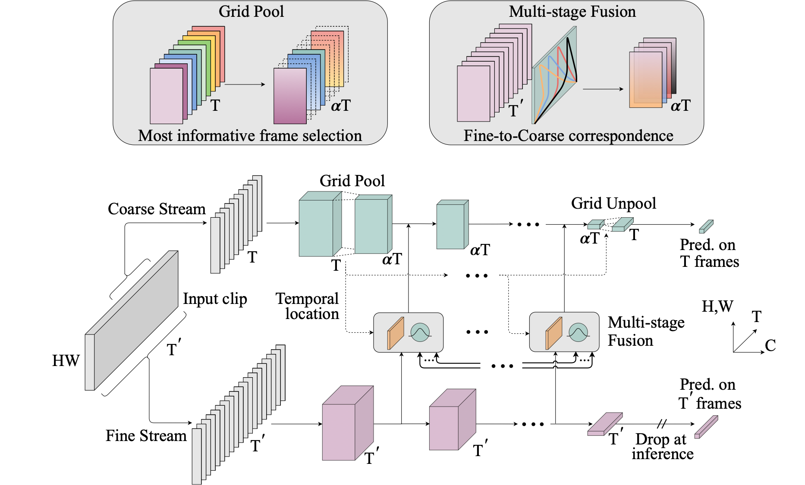
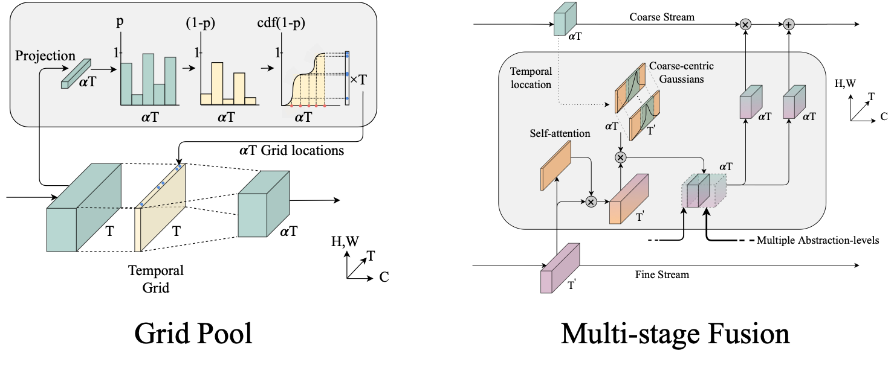
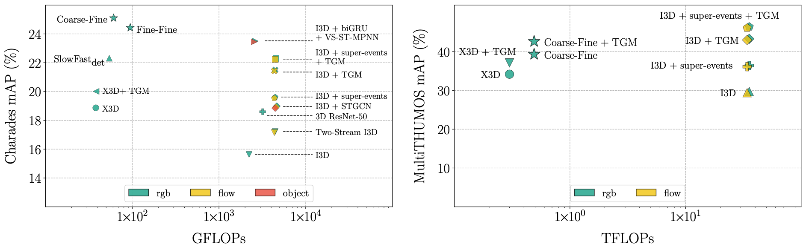

# Coarse-Fine Networks for Temporal Activity Detection in Videos

This repository contains the official PyTorch implementation for our CVPR2021 paper titled "Coarse-Fine Networks for Temporal Activity Detection in Videos". We propose a novel two-stream video architecture to process inputs in two temporal resolutions, which achieves a new state-of-the-art on Charades dataset with significant improvement in efficiency.

### Introduction





### Results



### Dependencies

- Python 3.7.6
- PyTorch 1.7.0 (built from source, with [this fix](https://github.com/pytorch/pytorch/pull/40801))
- torchvision 0.8.0 (built from source)
- accimage 0.1.1
- pkbar 0.5

### Quick start

### Reference

If you find this useful, please consider citing our work:
```
@inproceedings{kahatapitiya2021coarse,
  title={Coarse-Fine Networks for Temporal Activity Detection in Videos},
  author={Kahatapitiya, Kumara and Ryoo, Michael S},
  booktitle={Proceedings of the IEEE/CVF Conference on Computer Vision and Pattern Recognition},
  year={2021}
}
```

### Acknowledgements

I would like to thank the original authors of X3D [[CVPR2020]](http://openaccess.thecvf.com/content_CVPR_2020/papers/Feichtenhofer_X3D_Expanding_Architectures_for_Efficient_Video_Recognition_CVPR_2020_paper.pdf) and Multigrid training [[CVPR2020]](http://openaccess.thecvf.com/content_CVPR_2020/papers/Wu_A_Multigrid_Method_for_Efficiently_Training_Video_Models_CVPR_2020_paper.pdf) for their inspiring work.
